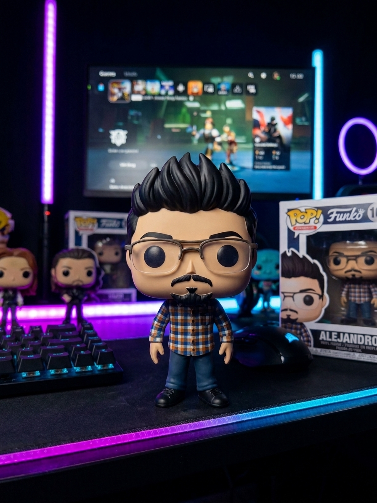
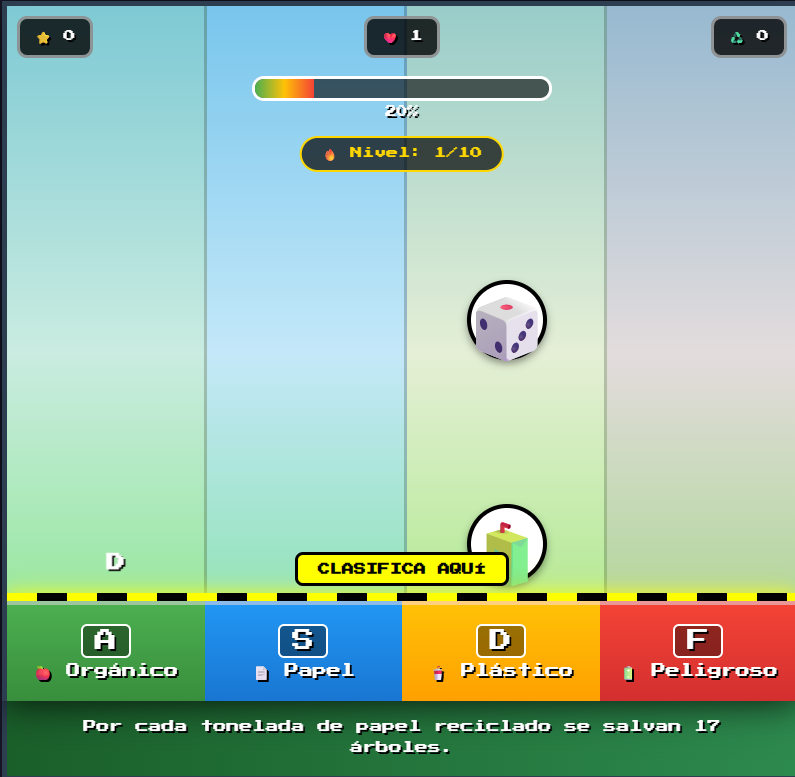
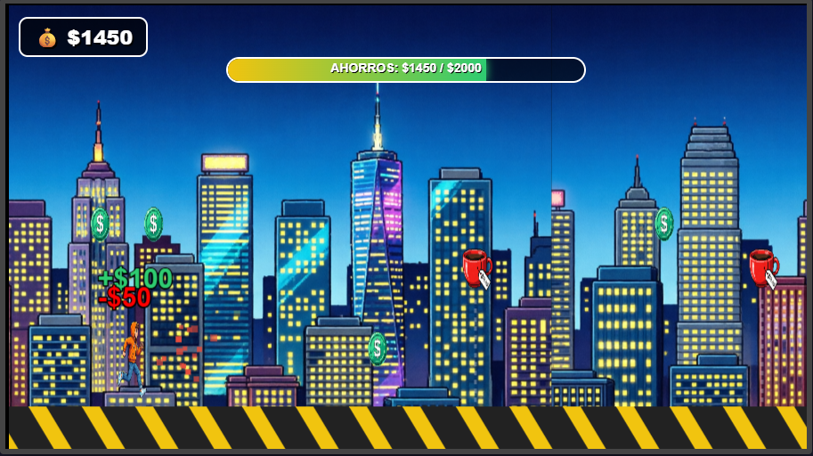

# 🎮project-library-game-development

---

## 👋 Sobre mí

**Hola, soy Alejandro**  
Apasionado por crear experiencias interactivas y videojuegos. Actualmente estudiante de Ing. Sistemas Informáticos de la universidad privada del valle. Me interesa especialmente el diseño de mecánicas, la narrativa y la programación de juegos.

---

## 🕹️ Galería de proyectos

| Juego | Captura |
|-------|---------|
| [**1.AritmatPlus**](./juegos/1.AritmatPlus/) |  |
| [**2.EcoSprint**](./juegos/2.EcoSprint/) |  |
| [**3.SaledSnake**](./juegos/3.SaledSnake/) |  |
| [**4.Retogota**](./juegos/4.Retogota/) |  |
| [**5.CiberGhost**](./juegos/5.CiberGhost/) |  |
| [**6.ahoracorre**](./juegos/6.ahoracorre/) |  |

> Haz clic en el nombre del juego para ver su documentación completa.

---

## 🛠️ Tecnologías y herramientas

- **Desarrollo**: HTML,CSS,JavaScript
- **Control de versiones**: Git, GitHub

---

## 🤖 Uso de IA

En los proyectos he utilizado herramientas de inteligencia artificial para:
- Generación de sprites con ChatGPT.
- Asistencia en código con QWEN 3.7.
- Creación de diálogos o textos.

---

## 📬 Contacto

- [Correo Institucional](Sqj2031548@est.univalle.edu)
- [Correo](J.alejandrosalazarq3@email.com)

---

## 📄 Licencia

Este portafolio y sus proyectos están bajo la licencia MIT.
