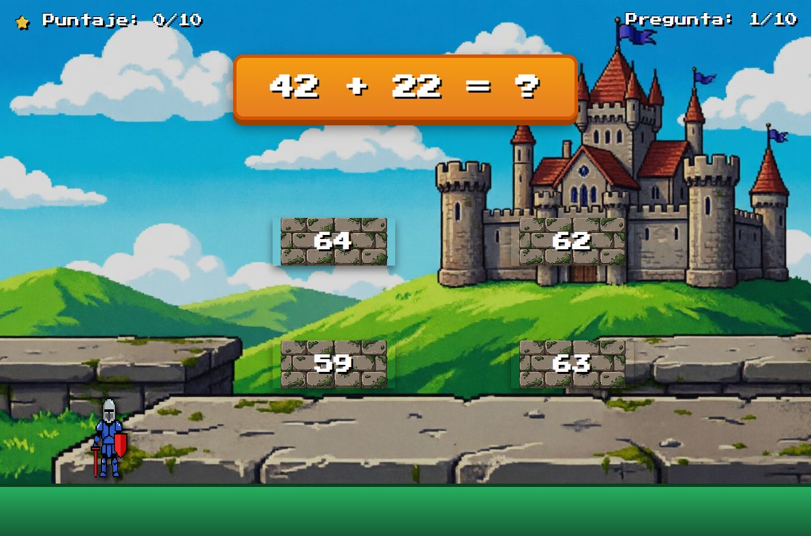

# Aritmat+

---

## 📖 Descripción

**Aritmat+** es un videojuego educativo de aventura y plataformas donde los jugadores deben resolver operaciones aritméticas para avanzar en una misión de rescate. El jugador controla a un caballero que debe responder correctamente 10 preguntas de sumas, restas, multiplicaciones y divisiones para salvar a la princesa del dragón.

**Objetivo del jugador:**  
Responder correctamente las 10 preguntas de operaciones aritméticas para rescatar a la princesa.

**Mecánica principal:**  
El jugador ve una pregunta matemática en la parte superior de la pantalla y debe seleccionar la respuesta correcta entre 4 plataformas flotantes. Cada respuesta correcta suma 1 punto y el caballero se desplaza hacia la plataforma elegida.

---

## 🎮 Género

`Educativo` | `Plataformas` | `Aventura` | `Arcade`

---

## 🎯 Controles

| Acción | Método |
|--------|--------|
| Seleccionar respuesta | Hacer clic en una de las 4 plataformas con el mouse |
| Reiniciar juego | Hacer clic en el botón "Jugar de nuevo" al finalizar |

> **Nota:** El juego está diseñado para ser jugado completamente con el mouse.

---

## ⚙️ Tecnología

- **Lenguaje:** HTML, CSS y JavaScript (vanilla)
- **Estilo:** CSS con animaciones y efecto pixel art
- **Fuente:** Google Fonts - Press Start 2P (estilo retro)
- **Assets:** Imágenes propias (caballero, princesa, plataformas, fondo)
- **Alojamiento:** GitHub Pages (juego 100% en navegador)

---

## 📋 Requisitos del cliente (cumplidos)

| Requisito | Estado |
|-----------|--------|
| Dirigido a estudiantes de 1ro de secundaria | ✅ |
| Temática de aventura de plataformas | ✅ |
| 10 preguntas de operaciones aritméticas | ✅ |
| Incluye sumas, restas, multiplicaciones y divisiones | ✅ |
| 4 alternativas de respuesta por pregunta | ✅ |
| 1 punto por respuesta correcta | ✅ |
| Puntuación final sobre 10 | ✅ |
| Feedback si es correcto o incorrecto | ✅ |
| Permite completar las 10 preguntas y ver resultado final | ✅ |
| Funciona en navegador web | ✅ |
| Generado con IA (prompts) | ✅ |

---

## 🤖 Uso de IA

Este videojuego fue desarrollado con asistencia de inteligencia artificial:

- **Generación del código base:** ChatGPT / QWEN 3.7 (estructura HTML, CSS y JavaScript).
- **Corrección de errores:** La IA ayudó a depurar problemas como:
  - Sistema de puntuación que no actualizaba correctamente.
  - Posicionamiento de las plataformas en pantalla.
  - Animación del caballero al seleccionar respuesta.
- **Mejoras visuales:** Sugerencias de diseño de interfaz y paleta de colores.

---

## 🧠 ¿Qué aprendí?

- **Integración de IA en el desarrollo:** Aprendí a redactar prompts efectivos para generar código funcional y a iterar sobre el resultado.
- **Diseño de juegos educativos:** Comprender cómo equilibrar la diversión con el aprendizaje, manteniendo la motivación del jugador.
- **JavaScript interactivo:** Manejo de eventos, manipulación del DOM y lógica de juego en tiempo real.
- **CSS avanzado:** Animaciones, posicionamiento absoluto y diseño responsive para una experiencia inmersiva.

---

## 🔮 Mejoras futuras

- [ ] Agregar efectos de sonido al seleccionar respuestas.
- [ ] Incluir un sistema de vidas o intentos.
- [ ] Aumentar la dificultad progresivamente (operaciones más complejas).
- [ ] Agregar más personajes o niveles temáticos.
- [ ] Implementar una tabla de puntuaciones altas (localStorage).
- [ ] Traducir el juego a inglés para mayor alcance.

---

## ▶️ Cómo jugar

**Jugar online (recomendado):**  
👉 [**Jugar Aritmat+**](https://DarkStar303.github.io/project-library-game-development/juegos/1.AritmatPlus/)

**Descargar y jugar localmente:**  
1. Clona el repositorio o descarga los archivos.
2. Abre el archivo `Aritmat+.html` en tu navegador favorito.
3. ¡Disfruta del juego!

---

