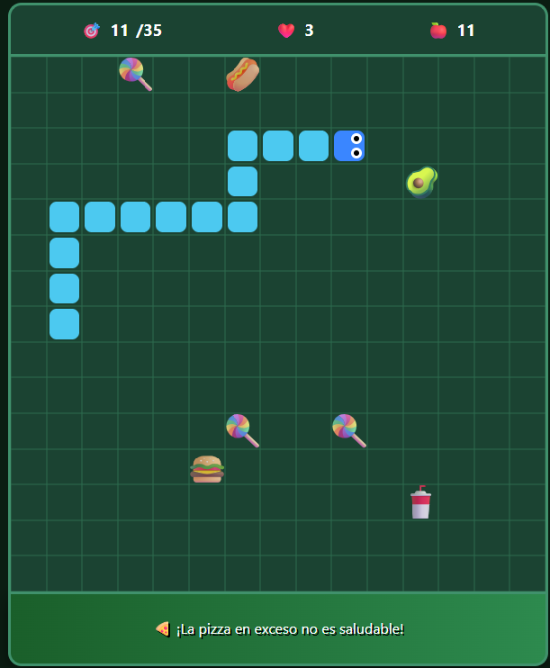

# 🥗SaledSnake

---

## 📖 Descripción

**SaledSnake** es una versión educativa del clásico juego de la serpiente, diseñada para enseñar a los escolares a elegir alimentos saludables. El jugador controla una serpiente que debe comer frutas y verduras para sumar puntos, mientras evita la comida chatarra que aparece como obstáculo. Cada 5 alimentos saludables consumidos, aparecen 3 nuevos obstáculos de comida chatarra, aumentando la dificultad progresivamente.

**Objetivo del jugador:**  
Alcanzar 35 puntos comiendo alimentos saludables y esquivando la comida chatarra, con 3 vidas disponibles.

**Mecánica principal:**  
La serpiente se mueve por un tablero de 15x15 casillas; al comer un alimento saludable (🍎🍌🥕🍇...), el jugador suma 1 punto y la serpiente crece. Al chocar con un obstáculo de chatarra (🍔🍕🍭...), pierde una vida y la serpiente se reinicia en el centro.

---

## 🎮 Género

`Educativo` | `Arcade` | `Snake` | `Estrategia`

---

## 🎯 Controles

| Tecla | Acción |
|-------|--------|
| `W` | Mover hacia **arriba** |
| `A` | Mover hacia **izquierda** |
| `S` | Mover hacia **abajo** |
| `D` | Mover hacia **derecha** |

> **Nota:** El juego está diseñado para jugarse con teclado. No se puede cambiar de dirección 180° sobre sí mismo (ej. de derecha a izquierda).

---

## ⚙️ Tecnología

- **Lenguaje:** HTML, CSS y JavaScript (vanilla)
- **Renderizado:** Canvas 2D
- **Assets:** Emojis universales para alimentos y obstáculos
- **Alojamiento:** GitHub Pages (juego 100% en navegador)

---

## 📋 Características principales

| Característica | Estado |
|----------------|--------|
| Movimiento de serpiente con WASD | ✅ |
| Comida saludable que otorga puntos | ✅ |
| Obstáculos de comida chatarra que restan vidas | ✅ |
| Sistema de 3 vidas | ✅ |
| Objetivo de 35 puntos para ganar | ✅ |
| Aparición de 3 obstáculos cada 5 alimentos consumidos | ✅ |
| Mensajes educativos en el panel inferior | ✅ |
| Mensajes emergentes al perder vida (sin pausa eterna) | ✅ |
| Pantallas de inicio, game over y victoria | ✅ |
| Funciona en navegador web | ✅ |

---

## 🤖 Uso de IA

Este videojuego fue desarrollado con asistencia de inteligencia artificial:

- **Generación del código base:** ChatGPT / QWEN 3.7 (estructura HTML, CSS y JavaScript con Canvas).
- **Diseño de la mecánica:** La IA ayudó a definir la lógica de aparición de obstáculos cada 5 alimentos y el sistema de vidas.
- **Corrección de errores:** Se depuraron problemas de colisión, reinicio de la serpiente y mensajes de advertencia.
- **Contenido educativo:** Los mensajes sobre alimentación saludable fueron generados y verificados con IA.

---

## 🧠 ¿Qué aprendí?

- **Adaptación de un clásico:** Transformar el juego de Snake en una herramienta educativa, manteniendo la jugabilidad adictiva.
- **Manejo de colisiones y estados:** Implementé detección de choques con pared, cuerpo, obstáculos y comida.
- **Sistema de vidas y reinicio:** Aprendí a gestionar estados de juego (vidas, pérdida de vida, game over) sin interrumpir la experiencia.
- **UI/UX educativa:** Incorporación de mensajes emergentes y panel informativo para reforzar el aprendizaje.
- **Iteración con IA:** Uso de prompts para ajustar la dificultad y el equilibrio del juego.

---

## 🔮 Mejoras futuras

- [ ] Agregar efectos de sonido al comer y al perder vida.
- [ ] Incluir más tipos de alimentos saludables y chatarra.
- [ ] Sistema de puntuación alta con almacenamiento local.
- [ ] Niveles con diferentes objetivos (ej. 50 puntos, más obstáculos).
- [ ] Modo multijugador local por turnos.
- [ ] Traducción a inglés para mayor alcance.

---

## ▶️ Cómo jugar

**Jugar online (recomendado):**  
👉 [**Jugar SaledSnake**](https://DarkStar303.github.io/project-library-game-development/juegos/3.SaledSnake/)

**Descargar y jugar localmente:**  
1. Clona el repositorio o descarga los archivos.
2. Abre el archivo `SaledSnake.html` en tu navegador favorito.
3. ¡Disfruta del juego y aprende a comer sano!

---
