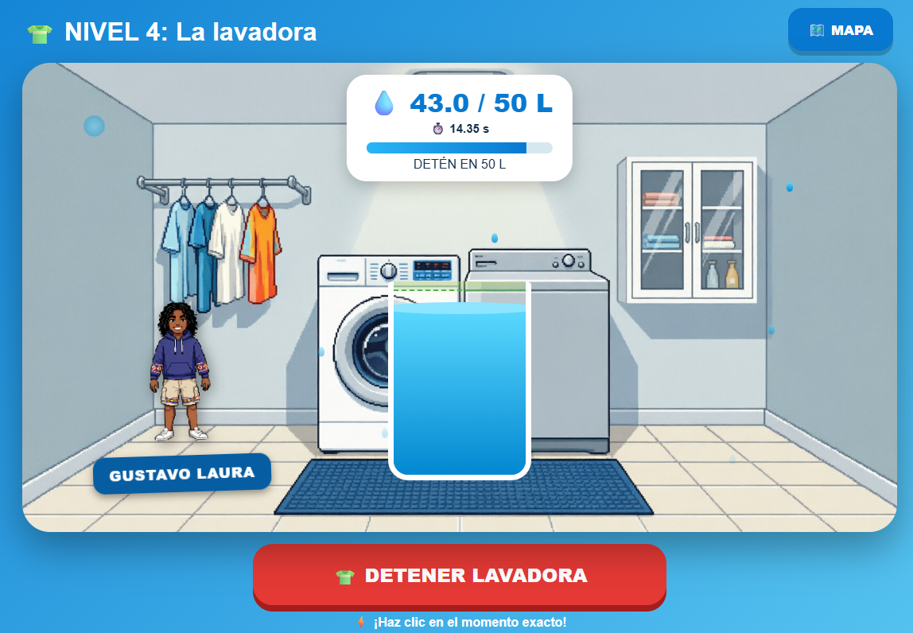

# 💧 Reto Gota 

---

## 📖 Descripción

**Reto Gota** es un videojuego educativo diseñado para concienciar sobre el ahorro de agua en jóvenes de 18 a 25 años, utilizando al personaje **Gustavo Laura** como protagonista. El jugador debe detener el flujo de agua en el momento exacto para alcanzar el objetivo de litros en cada nivel, aprendiendo así a controlar el consumo de agua en actividades cotidianas como ducharse, lavar ropa o regar plantas.

**Objetivo del jugador:**  
Completar los 8 niveles deteniendo el agua con la mayor precisión posible para obtener 3 estrellas y acumular puntos.

**Mecánica principal:**  
El agua sube automáticamente en un recipiente visual. El jugador debe presionar el botón de "DETENER" en el momento justo en que el nivel de agua alcanza la cantidad objetivo (medida en litros). Cuanto más preciso sea, más estrellas y puntos obtendrá.

---

## 🎮 Género

`Educativo` | `Simulación` | `Precisión` | `Arcade`

---

## 🎯 Controles

| Acción | Método |
|--------|--------|
| Detener el flujo de agua | Hacer clic en el botón **"DETENER"** en la parte inferior de la pantalla |
| Navegar en el mapa de niveles | Hacer clic en las tarjetas de nivel desbloqueadas |
| Regresar al mapa | Usar el botón **🗺️ MAPA** |

> **Nota:** El juego está diseñado para jugarse con mouse o pantalla táctil. El momento exacto del clic es clave para la puntuación.

---

## ⚙️ Tecnología

- **Lenguaje:** HTML, CSS y JavaScript (vanilla)
- **Almacenamiento:** localStorage para guardar progreso (estrellas, puntos, niveles desbloqueados)
- **Assets:** Emojis universales y escenas temáticas
- **Alojamiento:** GitHub Pages (juego 100% en navegador)

---

## 📋 Características principales

| Característica | Estado |
|----------------|--------|
| 8 niveles temáticos sobre ahorro de agua | ✅ |
| Sistema de precisión con 3 estrellas por nivel | ✅ |
| Guardado de progreso en localStorage | ✅ |
| Personaje principal (Gustavo Laura) con animaciones | ✅ |
| Barras de progreso y feedback visual | ✅ |
| Sistema de puntos acumulables | ✅ |
| Efectos visuales (gotas, partículas, splash) | ✅ |
| Consejos educativos en cada nivel | ✅ |
| Pantalla de inicio, mapa y resultados | ✅ |
| Funciona en navegador web | ✅ |

---

## 🧑 Personaje - Gustavo Laura (Player Persona)

| Campo | Descripción |
|-------|-------------|
| **Nombre** | Gustavo Laura |
| **Edad** | 22 años |
| **Ocupación** | Estudiante universitario |
| **Lugar** | Ciudad de La Paz, Bolivia |
| **Objetivo relacionado al agua** | Aprender a controlar su consumo diario de agua sin cambiar drásticamente su rutina |
| **Frustración** | Las campañas de ahorro de agua son aburridas y no le hablan directamente a su estilo de vida |
| **Hábito actual** | Deja correr el agua mientras se ducha o lava los platos, sin medir cuánto gasta |
| **Motivación** | Pequeños retos y gamificación que lo impulsen a mejorar sin sentirse presionado |
| **Cita representativa** | *"Si me muestran cuánta agua estoy gastando en cada acción, tal vez empiece a preocuparme."* |

---

## 🤖 Uso de IA

Este videojuego fue desarrollado con asistencia de inteligencia artificial:

- **Generación del código base:** ChatGPT / QWEN 3.7 (estructura HTML, CSS y JavaScript).
- **Diseño de niveles y objetivos:** La IA ayudó a definir los 8 escenarios y las cantidades de agua realistas.
- **Sistema de precisión y estrellas:** Se implementó la lógica de cálculo de precisión con prompts iterativos.
- **Corrección de errores:** Depuración de animaciones, transiciones entre niveles y guardado de progreso.
- **Contenido educativo:** Los consejos y mensajes de cada nivel fueron generados con asistencia de IA.

---

## 🧠 ¿Qué aprendí?

- **Diseño de juegos educativos con propósito social:** Cómo conectar una mecánica simple (precisión) con un mensaje importante (ahorro de agua).
- **Sistema de progreso y guardado:** Implementación de localStorage para mantener el avance del jugador entre sesiones.
- **Player Persona como herramienta de diseño:** Definir un personaje ficticio (Gustavo Laura) ayudó a enfocar todas las decisiones de diseño en un jugador realista.
- **Feedback visual inmediato:** Uso de barras de progreso, indicadores de precisión y animaciones para mantener al jugador informado.
- **Iteración con IA:** Refinamiento de prompts para obtener mejoras específicas en la jugabilidad y la experiencia de usuario.

---

## 🔮 Mejoras futuras

- [ ] Agregar efectos de sonido al detener el agua y al obtener estrellas.
- [ ] Incluir más niveles con escenarios realistas adicionales.
- [ ] Tabla de puntuaciones altas con ranking local.
- [ ] Animaciones más fluidas del personaje Gustavo Laura.
- [ ] Versión en inglés para mayor alcance.
- [ ] Compartir resultados en redes sociales.

---

## ▶️ Cómo jugar

**Jugar online (recomendado):**  
👉 [**Jugar Reto Gota**](https://DarkStar303.github.io/project-library-game-development/juegos/4.Retogota/)

**Descargar y jugar localmente:**  
1. Clona el repositorio o descarga los archivos.
2. Abre el archivo `retogota.html` en tu navegador favorito.
3. ¡Ayuda a Gustavo a ahorrar agua!

---
