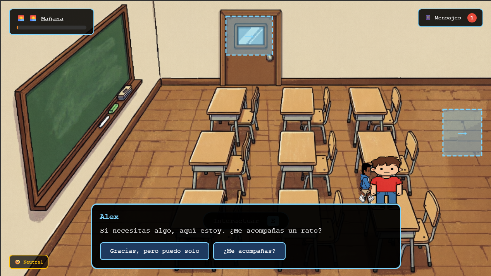

# 👻 CiberGost

---

## 📖 Descripción

**CiberGost** es un videojuego educativo de simulación y narrativa interactiva diseñado para concienciar sobre el bullying y la salud mental en adolescentes y jóvenes. El jugador controla a un estudiante que atraviesa un día difícil en el colegio, recibiendo mensajes ofensivos y enfrentando situaciones de acoso escolar. A través de diálogos con compañeros, profesores y familiares, el jugador debe tomar decisiones que afectan su nivel de confianza y su estado emocional, mientras un misterioso fantasma lo guía y le ofrece apoyo.

**Objetivo del jugador:**  
Navegar por el día (mañana, mediodía, tarde y noche) tomando decisiones que aumenten la confianza y permitan afrontar el bullying de manera saludable, buscando apoyo en personas cercanas.

**Mecánica principal:**  
El jugador se mueve libremente por cuatro escenarios (aula, biblioteca, patio y cuarto) usando las teclas WASD o flechas. Puede interactuar con NPCs (Alex, Sam, el profesor y la mamá) presionando la tecla **E**, lo que abre diálogos con opciones de respuesta que afectan la confianza. También recibe mensajes en el celular (tecla **M**) que simulan el acoso y el apoyo, y debe decidir cómo responder. Un fantasma aparece para ofrecer consejos y reflexiones. El juego transcurre en tiempo real y termina al anochecer, mostrando un final basado en las decisiones tomadas.

---

## 🎮 Género

`Educativo` | `Simulación` | `Narrativa interactiva` | `Aventura conversacional`

---

## 🎯 Controles

| Tecla | Acción |
|-------|--------|
| `W` `A` `S` `D` / `Flechas` | Moverse por el escenario |
| `E` | Interactuar con NPCs, objetos o salidas |
| `M` | Abrir el panel de mensajes del celular |
| `I` | Ver controles durante el juego |
| `F1` | Activar/desactivar modo debug (colisiones) |
| `ESC` | Cerrar diálogos, paneles o menús |

> **Nota:** El juego está diseñado para teclado. Todas las interacciones se realizan con teclas.

---

## ⚙️ Tecnología

- **Lenguaje:** HTML, CSS y JavaScript (vanilla)
- **Renderizado:** Canvas 2D
- **Assets:** Imágenes propias para escenarios, personajes y fantasma
- **Audio:** Música de fondo y efectos de sonido (pisadas, notificaciones)
- **Almacenamiento:** No utiliza localStorage (experiencia completa en una sesión)
- **Alojamiento:** GitHub Pages (juego 100% en navegador)

---

## 📋 Características principales

| Característica | Estado |
|----------------|--------|
| 4 escenarios interactivos (aula, biblioteca, patio, cuarto) | ✅ |
| Movimiento libre con WASD/flechas | ✅ |
| Sistema de diálogos con opciones y consecuencias | ✅ |
| 4 NPCs con historias y diálogos ramificados | ✅ |
| Sistema de confianza (0-100) que afecta la velocidad y los finales | ✅ |
| Mensajes de celular (bullying y apoyo) con opciones de respuesta | ✅ |
| Fantasma guía que ofrece reflexiones y consejos | ✅ |
| Ciclo de día/noche con transición visual | ✅ |
| Múltiples finales según las decisiones tomadas | ✅ |
| Música de fondo y efectos de sonido (pisadas, notificaciones) | ✅ |
| Modo debug (F1) para ver colisiones | ✅ |
| Funciona en navegador web | ✅ |

---

## 🤖 Uso de IA

Este videojuego fue desarrollado con asistencia de inteligencia artificial:

- **Generación del código base:** ChatGPT / QWEN 3.7 (estructura HTML, CSS, JavaScript con Canvas).
- **Diseño de diálogos y narrativa:** La IA ayudó a crear diálogos realistas y opciones de respuesta con impacto en la confianza.
- **Sistema de mensajes y eventos:** Se generaron mensajes de bullying y apoyo con IA, asegurando variedad y credibilidad.
- **Lógica de finales:** La IA asistió en la definición de condiciones para los diferentes finales (bueno, regular, malo).
- **Corrección de errores:** Depuración de colisiones, transiciones entre escenas y gestión de estados.

---

## 🧠 ¿Qué aprendí?

- **Diseño de juegos narrativos con propósito social:** Cómo abordar temas sensibles como el bullying y la salud mental a través de mecánicas de diálogo y elección.
- **Sistema de diálogos ramificados:** Implementación de árboles de diálogo con opciones que afectan variables del juego (confianza, objetivos).
- **Gestión de estados y escenas:** Manejo de múltiples escenarios, transiciones y persistencia del estado del jugador.
- **Feedback emocional:** Uso de indicadores de estado de ánimo y mensajes del fantasma para reflejar el progreso del jugador.
- **Múltiples finales:** Diseño de condiciones de victoria/derrota basadas en decisiones acumulativas.
- **Iteración con IA:** Refinamiento de prompts para obtener diálogos más realistas y una experiencia más inmersiva.

---

## 🔮 Mejoras futuras

- [ ] Agregar más escenarios y NPCs con historias adicionales.
- [ ] Sistema de logros o desbloqueables.
- [ ] Soporte para guardar partida (localStorage).
- [ ] Más variedad de mensajes y eventos aleatorios.
- [ ] Traducción a inglés para mayor alcance.
- [ ] Versión con soporte para pantalla táctil (gestos).
- [ ] Incluir estadísticas finales detalladas (decisiones tomadas, apoyo recibido).

---

## ▶️ Cómo jugar

**Jugar online (recomendado):**  
👉 [**Jugar CiberGost**](https://DarkStar303.github.io/project-library-game-development/juegos/5.CiberGost/)

**Descargar y jugar localmente:**  
1. Clona el repositorio o descarga los archivos.
2. Abre el archivo `CiberGhost.html` en tu navegador favorito.
3. Ayuda al protagonista a superar el bullying y encontrar apoyo.

---
